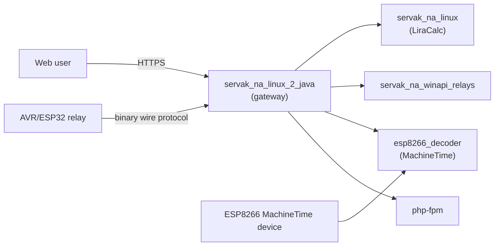

# Multi-Server IoT and Web Platform

A Java HTTPS gateway fronting a small constellation of purpose-built C++ backends and IoT
hardware — relay control, machine-runtime tracking, and a legacy calculator server, all behind
one authenticated, SSL-terminating front door.

## The Platform

| Component | Role |
|---|---|
| [`servak_na_linux_2_java`](servak_na_linux_2_java/README.md) | **The gateway.** Java. Terminates HTTPS/ACME, authenticates users, serves static and PHP content, and reverse-proxies everything else to the backends below. |
| [`servak_na_linux`](servak_na_linux/server/README.md) | **LiraCalc.** The project's original, first-generation server — a metalworking-machine configuration builder (C++, Firebird). |
| [`servak_na_winapi_relays`](servak_na_winapi_relays/README.md) | **Relay control.** Cross-platform C++ server that talks to ESP32-relay hardware. |
| [`esp8266_decoder`](esp8266_decoder/README.md) | **MachineTime.** C++17 server tracking per-channel device runtime/occupancy. |



For the full technical picture (C4 diagram, data flow, build/deploy conventions), see
[docs/architecture-map.md](docs/architecture-map.md).

## Highlights

- **IoT relay control** — remote on/off and status for AVR/ESP32 relay hardware, over a compact
  custom binary wire protocol.
- **MachineTime** — per-channel start/stop occupancy tracking for up to 18 inputs per device,
  with day/month history.
- **LiraCalc** — a web-based configuration builder for a metalworking-machine calculator,
  exported in a custom `.cnf` format.
- **AI chat assistant** — proxied to any OpenAI-compatible LLM endpoint, with streaming replies
  and per-page system prompts.
- **SSL/ACME automation, PHP-FPM hosting, and a generic per-port reverse proxy** — all built
  into the gateway.

## Hardware

- [AVR_Relay](https://github.com/viteck1048/AVR_Relay) and
  [WiFi-modul-for-AVR_Relay](https://github.com/viteck1048/WiFi-modul-for-AVR_Relay) — the AVR
  relay device and its network module.
- [rvs2](https://github.com/viteck1048/rvs2) — ESP32-relay devices driven by
  `servak_na_winapi_relays`.

## Running It

Every server starts and stops together, via the scripts in `strt-stp_srvrs_linux/` (Linux,
including the production systemd setup) or `strt-stp_srvrs_win/` (Windows).

### Linux — quick start

```bash
cd strt-stp_srvrs_linux/
chmod +x autorun_tmux.sh
./autorun_tmux.sh
```

Starts every server in its own `tmux` window, each compiling itself on the way up. See
[strt-stp_srvrs_linux/README.md](strt-stp_srvrs_linux/README.md) for the production
(systemd-managed) setup.

### Windows

```batch
cd strt-stp_srvrs_win\
start_servers.bat
:: stop_servers.bat to stop
```

## Configuration

The gateway reads a `config.ini` — **not tracked in git**, since it holds passwords, tokens and
private keys. Every key it reads, its type, and what happens if it's missing or malformed is
documented in [servak_na_linux_2_java/CONFIG.md](servak_na_linux_2_java/CONFIG.md).

## License

This project is licensed under the MIT License. See [LICENSE](LICENSE) for details.
