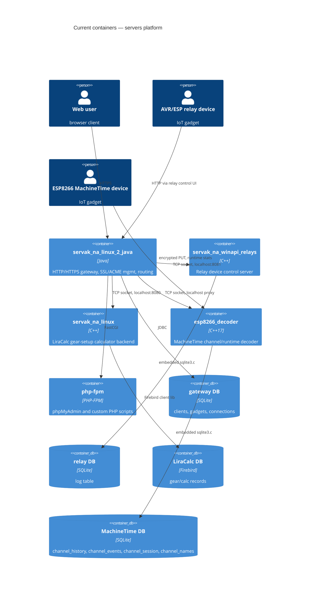

# Architecture map — servers (multi-server IoT and web platform)

> The **current** architecture (what exists today), produced by `survey` and read by
> specify / design / data-model / implement. Refresh with `survey` when the repo drifts past
> `reflects_commit`. This is generated; `README.md` is the hand-maintained authored doc and is
> reconciled below — not replaced.

## Stack

- Language / runtime: Java (`servak_na_linux_2_java/source/*.java`, no build tool — compiled via `compilAndRun.sh`); C++17 (`esp8266_decoder`, `servak_na_winapi_relays`, `servak_na_linux`)
- Frameworks: none — hand-rolled HTTP parsing/socket servers in both Java and C++; JSON via `nlohmann/json.hpp` (`servak_na_linux/server/KM_server.cpp:1`)
- Build / test / lint: `compilAndRun.sh` per module (Java, LiraCalc, MachineTime); `servak_na_winapi_relays/build_linux.sh` (`cmake .. && make -j$(nproc)`); no test or lint command found in any module

## C4 — system as it is

## Module inventory

| Module | Path | Layers | Wired at | Responsibility |
|---|---|---|---|---|
| servak_na_linux_2_java | `servak_na_linux_2_java/source` | flat package: `*Handler.java` + net (`NetworkClient`, `ClientHandler`) + db (`DatabaseHelper`) + config (`Configs`) + `CertificateManager` | `source/ClientHandler.java:20-65` | Main Java gateway: HTTP/HTTPS entry, SSL/ACME, static + PHP-FPM delegation, reverse-proxy to the C++ servers |
| servak_na_winapi_relays | `servak_na_winapi_relays/source` | entry (`server_relays.cpp`) + domain (`relay.cpp`) + HTTP handlers (`relay_http_handlers.cpp`) + platform compat (`platform.h`) | `source/server_relays.cpp:119-140` | Relay device (ESP32/AVR) control server, WinAPI-based but Linux-portable |
| servak_na_linux (LiraCalc) | `servak_na_linux/server` | `KM_server.cpp` entry + per-operation files (`add.cpp`, `delete.cpp`, `save.cpp`, `get_json.cpp`, `status.cpp`, `index.cpp`, `db.cpp`) | `server/KM_server.cpp:1` | LiraCalc gear-setup calculator backend, Firebird-backed |
| esp8266_decoder (MachineTime) | `esp8266_decoder` | HTTP layer (parsing/routing/static files) + MachineTime domain logic (crypto, channel accounting) | `README.md:12-22` | Decodes ESP8266 MachineTime device telemetry, SQLite-backed |
| strt-stp_srvrs_linux / strt-stp_srvrs_win | scripts | — | — | Start/stop orchestration: tmux session (Linux), batch scripts (Windows) |

## Conventions (cited — the rules a new feature must match)

- **Module wiring / registration:** `HTTPRequest.ReversType` enum set in `ClientHandler`, dispatched to the matching `*Handler` — `source/HTTPRequest.java:35-44`
- **Error handling:** Java — `ban` flag on `HTTPRequest` → HTTP 403/500; `NetworkClient` I/O errors → HTTP 503 (`source/HTTPRequest.java:69-76`); C++ — `printf` logging, no exceptions (`servak_na_winapi_relays/source/relay_http_handlers.cpp:69-74`)
- **IDs:** `userID` (session int) after auth; gadgets keyed by `g_id` / `sn_mega` / `sn_esp` — `source/AvrRele.java:12-15`
- **Persistence / DB access:** JDBC + SQLite in the gateway (`source/DatabaseHelper.java:14-28`); embedded `sqlite3.c` in relay and MachineTime servers; Firebird client lib in LiraCalc (`servak_na_linux/server/database.fdb`)
- **Migrations:** none — `CREATE TABLE IF NOT EXISTS` only, no migration tool anywhere in the repo (tech-debt, see below)
- **Tests:** none automated (no JUnit/GTest); a few manual test pages only — `servak_na_linux_2_java/site_radm/root/__tests/testform.html`
- **Inter-module communication:** TCP socket via `NetworkClient` (Java gateway → C++ servers); FastCGI framing to php-fpm — `source/NetworkClient.java:20-40`, `servak_na_linux_2_java/HANDLERS.md:28-64`
- **UI / styling:** vanilla HTML/CSS/JS per module, no shared library or design system — `esp8266_decoder/www/MachineTime18Channels/css/machine_time.css:1-100`

## Datastores

| Store | Engine | Accessed via | Notes |
|---|---|---|---|
| gateway DB | SQLite | JDBC, `DatabaseHelper` (WAL mode, `busy_timeout=5000`) | tables: `clients`, `gadgets`, `connections` |
| relay DB | SQLite | embedded `sqlite3.c`, `SqliteHelper` RAII wrapper | single `log(id, msg)` table |
| LiraCalc DB | Firebird | `database.fdb`, schema in `server/www/DBscripts/firebird.sql` | business logic lives in C++, not in the DB |
| MachineTime DB | SQLite | embedded `sqlite3.c`, `SqliteHelper` | tables: `channel_history`, `channel_events`, `channel_session`, `channel_names` |

## Frontend / UI foundation

- **Component library / design system:** none — each module ships its own independent vanilla HTML/CSS/JS under its own `www/`
- **Design tokens:** none formalized; the same ad hoc colors (`#2980b9`, `#3498db`) recur across modules with no shared token file
- **Styling approach:** vanilla CSS per module — `esp8266_decoder/www/MachineTime18Channels/css/machine_time.css`
- **Shared primitives:** none — no reusable Button/Input/Card across modules
- **State / data-fetching:** none — no JS framework, plain DOM/fetch per page
- **Closest UI precedent:** a data-dashboard screen looks like the MachineTime calendar UI (`esp8266_decoder/www/MachineTime18Channels/index.html:1-50`); a device-control panel looks like `servak_na_linux_2_java/www/avr_relays_control.html`

## Where things live / closest precedents

- A new IoT-device feature → mirrors the AVR relay flow: `servak_na_linux_2_java/source/AvrRele.java` (gateway-side gadget logic) + `servak_na_winapi_relays/source/relay_http_handlers.cpp` (device-facing server), modelled end-to-end on the relay-command precedent.
- A new backend microservice → its own top-level folder, its own DB, wired into the gateway's `ReversType` dispatch (`source/HTTPRequest.java:35-44`) via a new `NetworkClient`-based handler; started/stopped through `strt-stp_srvrs_linux` / `strt-stp_srvrs_win`.
- A new screen / UI component → vanilla HTML/CSS/JS in the owning module's `www/`, modelled on `MachineTime18Channels` (`esp8266_decoder/www/MachineTime18Channels/index.html:1-50`) for a dashboard, or `avr_relays_control.html` for a control panel — there is no shared design system to compose from yet.

## Constraints & known tech-debt

- No automated tests or CI anywhere in the repo — a new feature can only be verified manually.
- No migration tooling — schema changes are ad hoc `CREATE TABLE IF NOT EXISTS`, no rollback path; `data-model` work here must introduce its own convention rather than follow one.
- `config.ini` holds live secrets and is gitignored — never commit it; only the example in `README.md` is tracked.
- Each module owns its own datastore with no cross-module transactions — consistency between gateway/relay/LiraCalc/MachineTime state is manual/eventual, not transactional.
- LiraCalc's Firebird choice is a legacy outlier against the SQLite convention used everywhere else — don't default new modules to Firebird.
- No shared frontend design system — UI (including colors) is duplicated per module; a new screen currently has no common primitives to reuse, only precedents to imitate.

## Reconciliation with the authored architecture doc

`README.md` is the hand-maintained authored doc (module list, run instructions, `config.ini` reference). This map is consistent with it: the three servers and the startup scripts match what's described. The README describes `servak_na_linux` only as "an additional C++ backend server for other specific tasks" — this map adds that it specifically hosts LiraCalc on Firebird — and doesn't mention `esp8266_decoder` (MachineTime) at all, which this map adds as a fourth server. No contradictions were found; these are additions, not drift.
